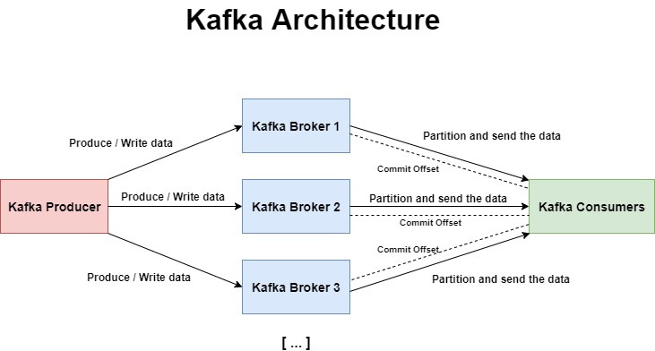

# Apache Kafka

<br>



<br>

### General Architecture
In Apache Kafka data streams are created from so-called **Topics** that are stored inside the Kafka Cluster. Kafka Servers, which are also called **Brokers**, stream the data from a topic to consumers that are subscribed to this topic. 

At any time only **one** of the Brokers is the active coordinator and the client only needs to connect to one broker in order to be connected to the whole Kafka cluster.

So, in short, an Apache Kafka Streaming Environment has three main components:

- **Producers**: They **produce** the data and send them to the Kafka Cluster
- **Broker**: Stores the arriving new data in the corresponding Topic and sends data to the Consumers
- **Consumers**: Subscribes to a topic and thus **receives** a stream of the data

### Setup
After installing Apache Kafka we can start the required environment. For this we need to have at least two shell sessions active.


In Shell 1 we start the **ZooKeeper Service** that's still required by Kafka:

```bash
$ cd kafka_2.13-2.7.0
$ bin/zookeeper-server-start.sh config/zookeeper.properties
```

In Shell 2 we start the Apache **Kafka Server**:

```bash
$ bin/kafka-server-start.sh config/server.properties
```

<hr>

### Useful Commands and Settings

#### Settings

###### config/server.properties
```bash
# Unique id for the broker
broker.id=0

# Number of partitions per topic and thus a factor for possible parallelism.
# Common rule of thumb: Partitions = Desired Throughput / Partition Speed
# (Estimation of speed for one partition: 10 MB/s)
num.partitions=1

# Use the log appending time instead of producer creation time for message timestamps
log.message.timestamp.type=LogAppendTime

# Connection string to be used by the Kafka Broker to register itself
zookeeper.connect=<ZOOKEEPER_HOSTNAME>:2181
```

#### Commands 

###### List all registered Kafka Topics
```bash 
./bin/kafka-topics.sh --list --zookeeper localhost:2181
```

###### Delete a specific topic (twitter-stream in this case)
```bash
./bin/zookeeper-shell.sh localhost:2181 deleteall /brokers/topics/twitter-stream
```

###### See all consumers and their information
```bash
./bin/kafka-consumer-groups.sh  --list --bootstrap-server localhost:9092

./bin/kafka-consumer-groups.sh --describe --group mygroup --bootstrap-server localhost:9092
```

###### See all available brokers
```bash
./bin/zookeeper-shell.sh localhost:2181 ls /brokers/ids
```