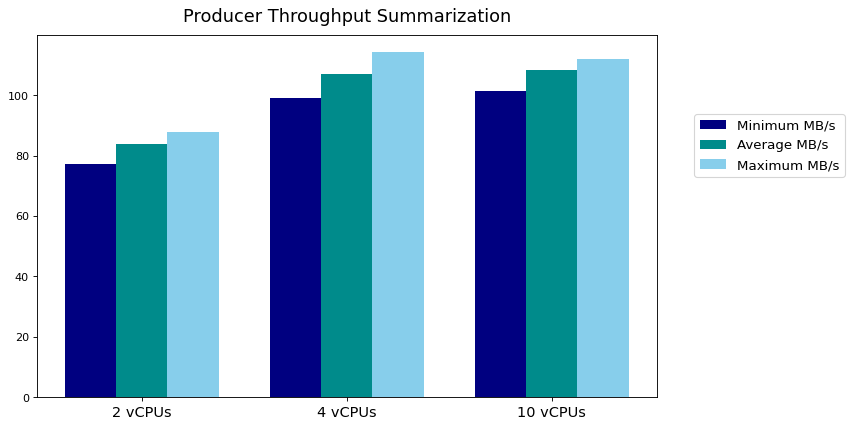
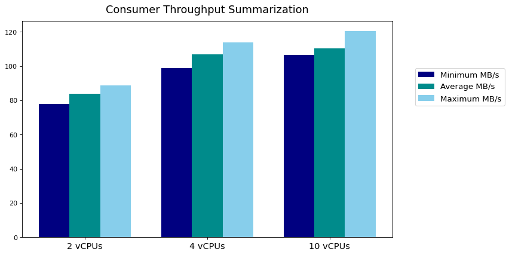
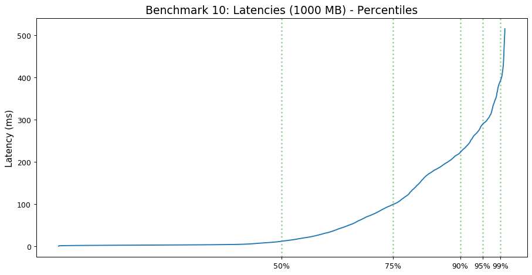
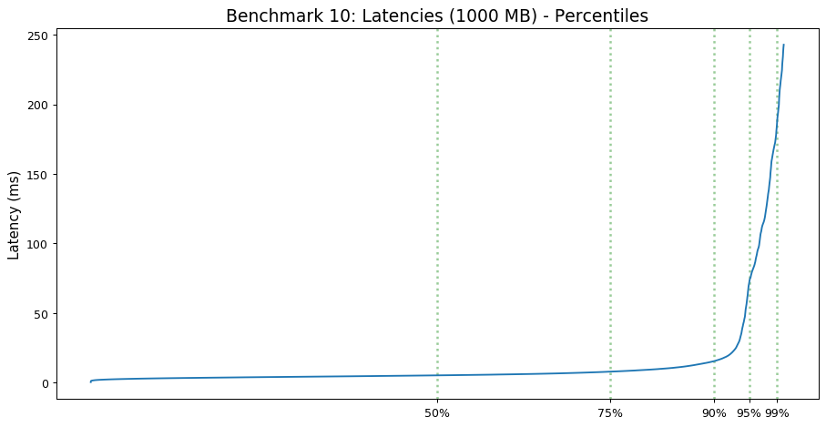
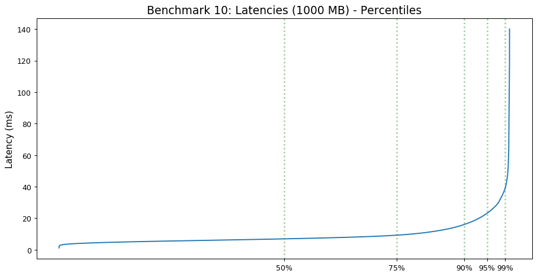

# Apache Kafka - 1 Broker

 

This section is dedicated to testing the performance of Apache Kafka using:
- **1** Kafka Broker 
- **1** Topic Partition 
- **1** Producer and Consumer

 

### Test Configuration
All VMs are running in the LRZ Cloud using Ubuntu 20.04.

##### Test Setup 1:
- **2** vCPUs
- **9** GB RAM

##### Test Setup 2:
- **4** vCPUS
- **18** GB RAM

##### Test Setup 3:
- **10** vCPUs
- **45** GB RAM

 

## Results
#### Producer Throughput

#### Consumer Throughput

#### Latency
##### 2 vCPUs

##### 4 vCPUs

##### 10 vCPUs

