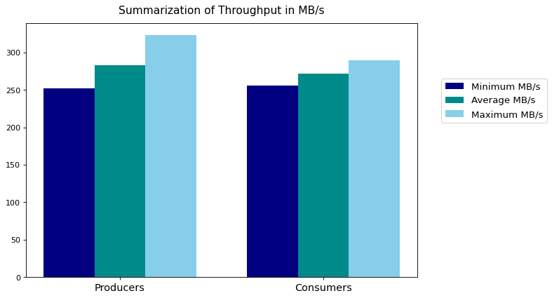
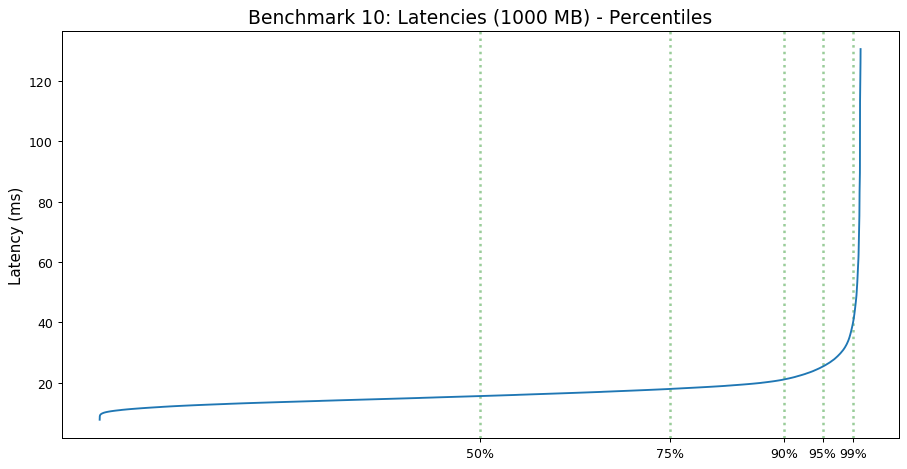
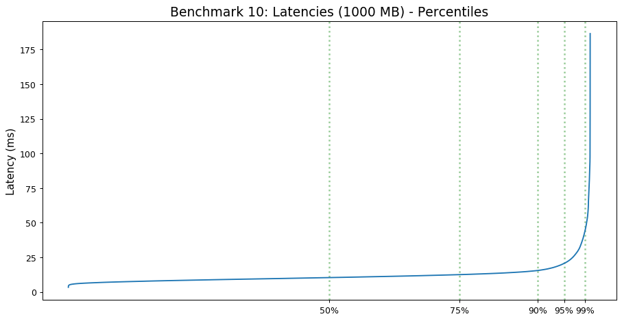
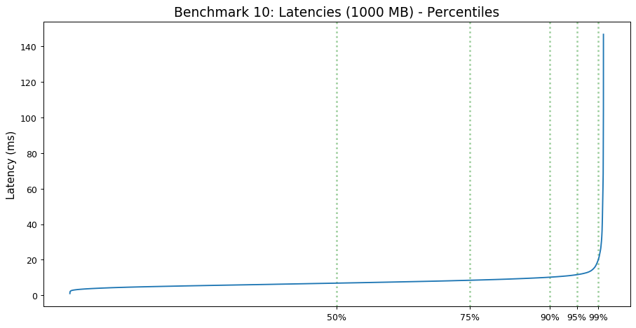

# Apache Kafka - 3 Brokers

 

This section is dedicated to testing the performance of Apache Kafka using:
- **3** Kafka Brokers 
- **3** Topic Partitions
- **3** Producers and Consumers

 

### Test Configuration
All VMs are running in the LRZ Cloud using Ubuntu 20.04.

##### Test Setup:
For each Broker we are using:
- **10** vCPUS
- **45** GB RAM

 

## Results
####  Throughput

#### Latency
##### Consumer 1

##### Consumer 2

##### Consumer 3
